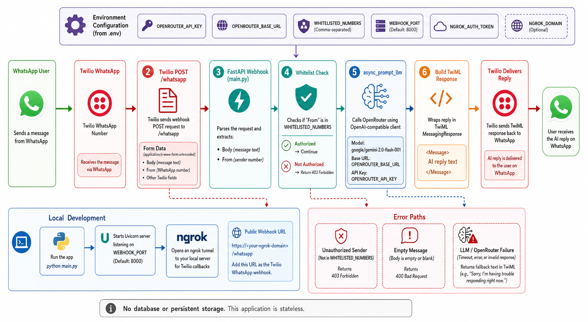

<div align="center">
  

  <h1>whatsapp-llm</h1>

  **🤖💬 Bridge WhatsApp to AI — send a message, get an intelligent response instantly 🚀**
</div>

whatsapp-llm is a FastAPI webhook service that connects WhatsApp messages to AI language models. Twilio forwards incoming WhatsApp messages to the app, the app checks the sender against a whitelist, calls OpenRouter through the OpenAI-compatible client, and returns the answer as TwiML.

Use it for a small personal WhatsApp assistant or for local webhook experiments with Twilio's WhatsApp Sandbox.

## Install

```bash
git clone https://github.com/tsilva/whatsapp-llm.git
cd whatsapp-llm
python -m venv .venv
source .venv/bin/activate
pip install -r requirements.txt
cp .env.example .env
python main.py
```

Set the printed ngrok URL plus `/whatsapp` as the Twilio WhatsApp Sandbox webhook, for example `https://your-ngrok-domain.ngrok-free.app/whatsapp`.

## Commands

```bash
pip install -r requirements.txt  # install runtime dependencies
python main.py                   # start FastAPI with an ngrok tunnel
```

## Notes

- Requires Python 3.10 or newer.
- `OPENROUTER_API_KEY`, `NGROK_AUTH_TOKEN`, and `WHITELISTED_NUMBERS` are required in `.env`.
- `WHITELISTED_NUMBERS` must use Twilio's WhatsApp sender format, such as `whatsapp:+12345678900`.
- `WEBHOOK_PORT` defaults to `8000`; `NGROK_DOMAIN` is optional.
- The current model is set in `main.py` to `google/gemini-2.0-flash-001`.
- The service is stateless and does not store messages.
- `.env.example` also includes `MODEL_ID` and `WEBHOOK_AUTH_TOKEN`, but the current application code does not read them.

## Architecture



## License

[MIT](LICENSE) © Tiago Silva
